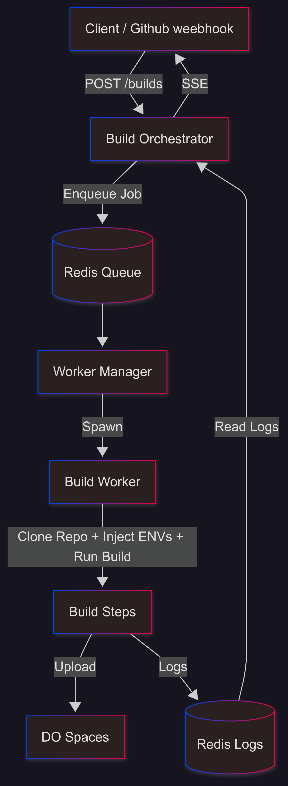

Vexl : React hosting platform 
Instantly host your react application while accessing the github repos source , get a custom subdomain better than vercel domain . fōr example yourname.vexl.live . I made this project to understand how vercel works and how  it deploys the react applications . It was challenging project due to how to do system design for this kinda of project . 

Build architecture

